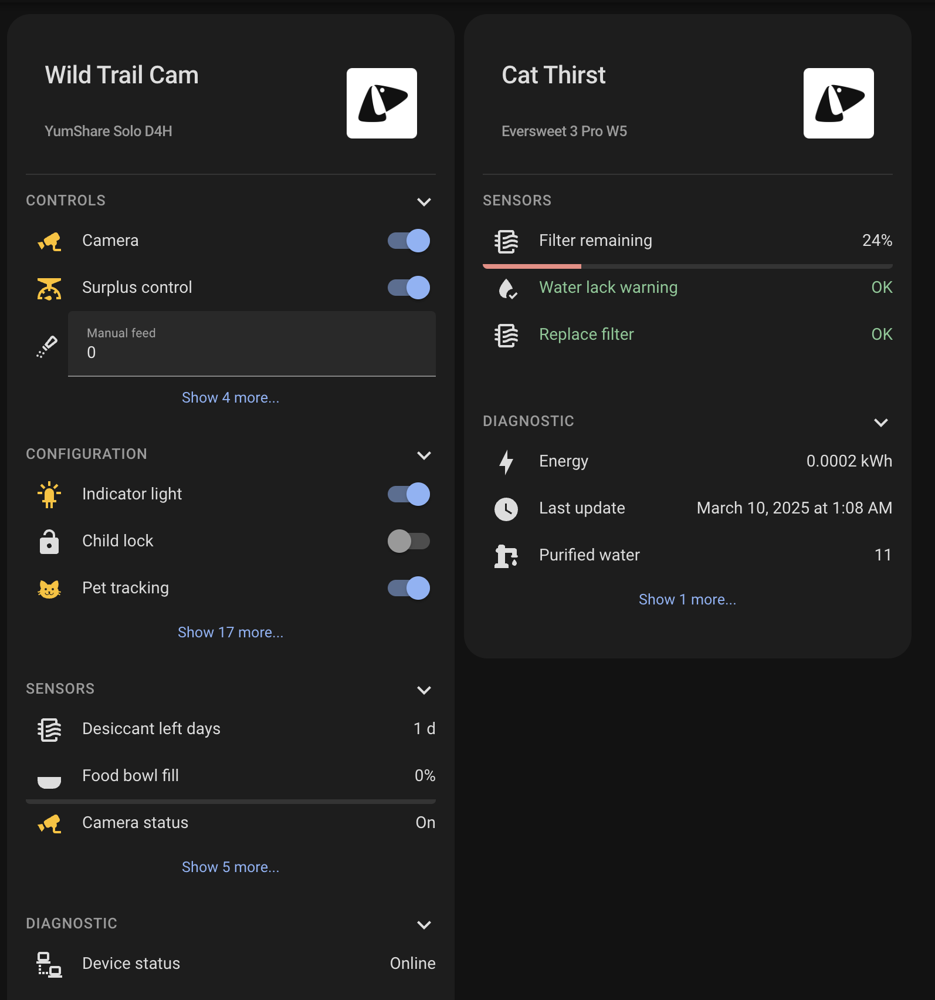
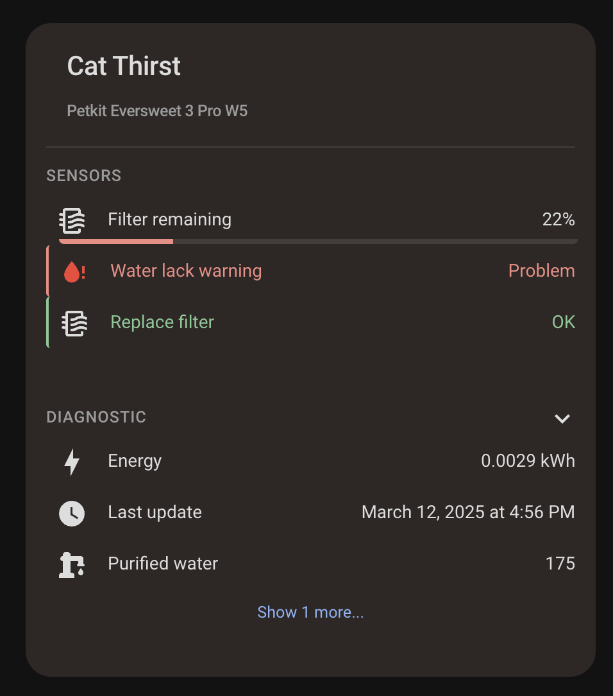
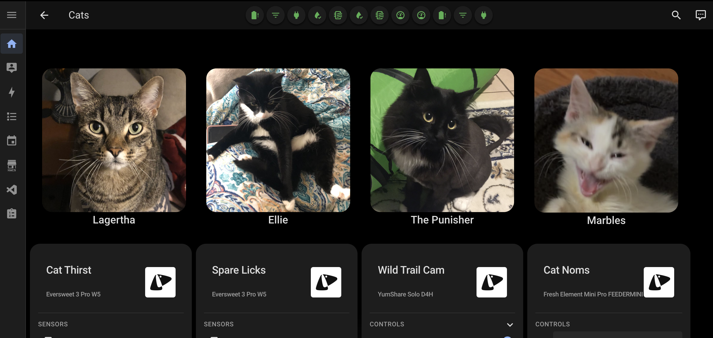
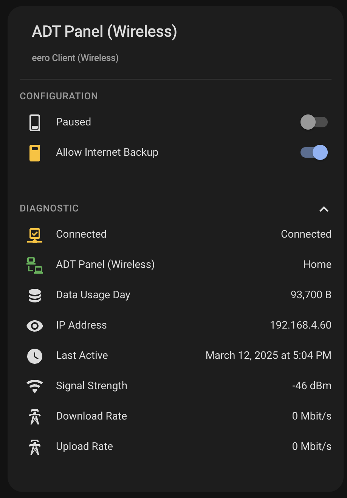
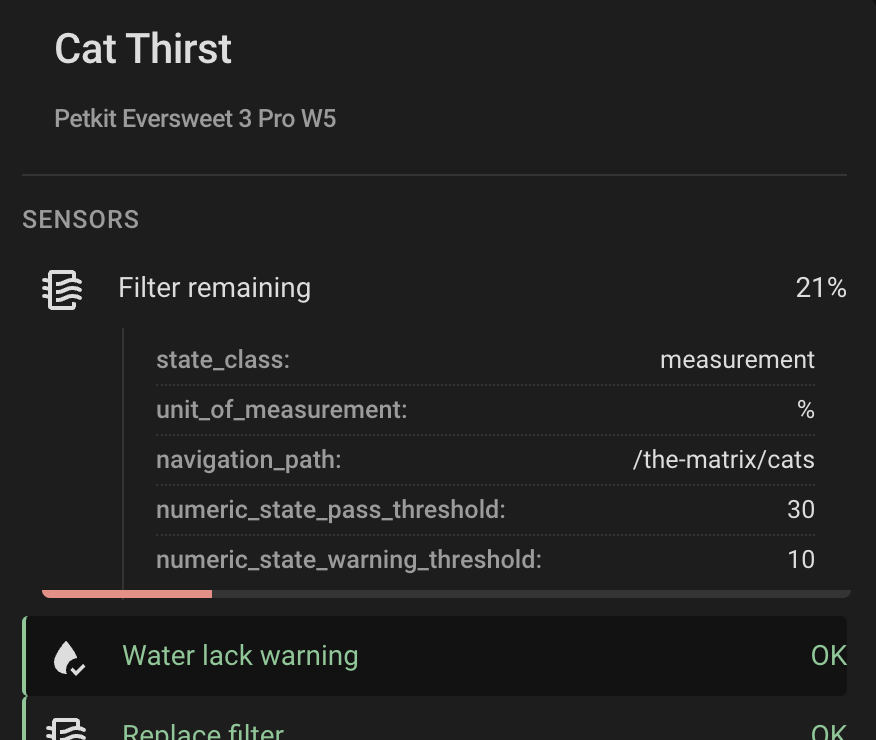
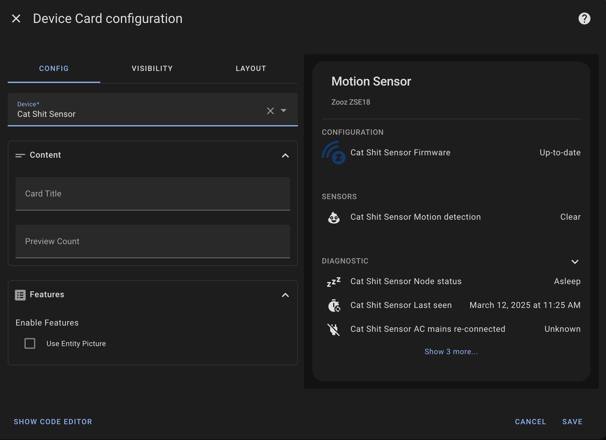
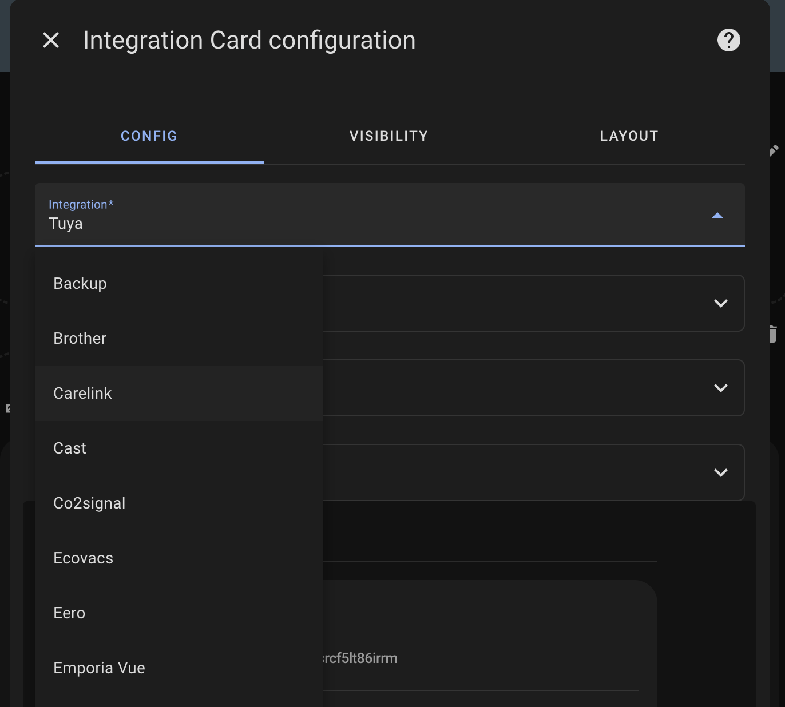

<p align="center">
    
</p>
<p align="center"><h1 align="center">Device Card</h1></p>
<p align="center">
	<em>A comprehensive card to display and organize your Home Assistant device entities</em>
</p>


[](https://github.com/hacs/integration)


<p align="center">Built with the tools and technologies:</p>
<p align="center">
	
	
	
	
	
</p>
<br>

## Overview

### Device Card

A custom card for Home Assistant that provides a comprehensive overview of any device in your system. The card organizes device information into expandable sections, displaying sensors, controls, configuration options, and diagnostic data in a clean, user-friendly interface.

### Integration Card

The Integration Card automatically finds and displays all devices from a selected integration domain. This is useful for:

- Viewing all your lights, sensors, or switches from a specific brand or system
- Creating dedicated dashboards for specific systems in your home
- Monitoring the status of all devices in an integration at once

## Features

### Device Information Display

- Shows device name and model information
- Organizes entities into logical categories:
  - Controls - for interactive elements like buttons and switches
  - Sensors - for data readings and status information
  - Configuration - for device settings
  - Diagnostic - for troubleshooting information


### Problem Detection

- Automatically detects entities labeled as "problem" in the device based on their `device_class`
- Visual indication when problems are detected (card border turns red)
- Easy identification of issues requiring attention
- Problem entities show a green or red indicator to their left



### Entity Pictures

With an optional flag, you can showcase entity pictures when available. There must exist an entity with an `entity_picture` attribute.



### Expandable Sections

- Collapsible sections for better organization of information
- Preview counts for sensors to reduce visual clutter
- Ability to expand sections to see all entities



### Entity Attributes

- Click an entity to expand it and show it's attributes
- This behavior can be disabled by setting `tap_action` to "none"



### Entity Interactions

- Configure custom actions for tap, hold, and double tap interactions
- Actions include navigating to other views, calling services, or opening more-info dialogs
- Setting a `tap_action` disables the entity attribute expansion behavior
- Actions can be configured in both YAML and the visual editor

### Visual Styling

- Consistent with Home Assistant design language
- Responsive layout that works on both desktop and mobile
- Clear visual hierarchy for easy reading

## Installation

### HACS (Recommended)

[](https://my.home-assistant.io/redirect/hacs_repository/?owner=homeassistant-extras&repository=device-card&category=dashboard)

1. Open HACS in your Home Assistant instance
2. Click the menu icon in the top right and select "Custom repositories"
3. Add this repository URL and select "Dashboard" as the category
   - `https://github.com/homeassistant-extras/device-card`
4. Click "Install"

### Manual Installation

1. Download the `device-card.js` file from the latest release in the Releases tab.
2. Copy it to your `www/community/device-card/` folder
3. Add the following to your `configuration.yaml` (or add as a resource in dashboards menu)

```yaml
lovelace:
  resources:
    - url: /local/community/device-card/device-card.js
      type: module
```

## Usage

Add the card to your dashboard using the UI editor or YAML:

### Card Editor

The card is fully configurable in the UI editor. Simply select "Custom: Device Card" when adding a new card to your dashboard, then select your device from the dropdown.



You can also add the integration card via the UI editor. It will accept mostly the same configuration as the device card.



### YAML

This is the most minimal configuration needed to get started on the device card:

```yaml
type: custom:device-card
device_id: YOUR_DEVICE_ID
```

The card will automatically:

- Display the device name and model information
- Organize all entities related to the device into appropriate sections
- Show collapsible sections for Controls, Configuration, Sensors, and Diagnostics
- Highlight any detected problems

This is the most minimal configuration needed for the integration card:

```yaml
type: custom:integration-card
integration: zwave_js
```

The card will automatically:

- Display a device card for each device in the integration

## Configuration Options

### Device Card

| Name              | Type   | Default      | Description                                                  |
| ----------------- | ------ | ------------ | ------------------------------------------------------------ |
| device_id         | string | **Required** | The Home Assistant device ID for your device                 |
| title             | string | Device name  | Optional custom title for the card                           |
| preview_count     | number | All items    | Number of items to preview before showing "Show More" button |
| exclude_sections  | list   | _none_       | Sections of entities to exclude. See below.                  |
| exclude_entities  | list   | _none_       | Entities to remove from the card.                            |
| section_order     | list   | _none_       | Custom order for displaying sections. See below.             |
| features          | list   | See below    | Optional flags to toggle different features                  |
| tap_action        | object | none         | Action to perform when tapping the card                      |
| hold_action       | object | none         | Action to perform when holding the card                      |
| double_tap_action | object | none         | Action when double-tapping the card                          |

#### Feature Options

| Name              | Type | Description                              |
| ----------------- | ---- | ---------------------------------------- |
| entity_picture    | flag | Show entity picture when available       |
| hide_device_model | flag | Hides the device model information       |
| hide_title        | flag | Hides the device card title              |
| compact           | flag | Uses compact layout with reduced spacing |

#### Section Options

The following section names can be used with both `exclude_sections` and `section_order`:

- controls
- configurations
- sensors
- diagnostics

For `section_order`, the default order is: Controls, Configuration, Sensors, Diagnostic. Any sections not specified in your custom order will be displayed after the specified ones.

### Integration Card

Most configuration options from the Device Card are supported:

| Name                   | Type    | Default      | Description                                                  |
| ---------------------- | ------- | ------------ | ------------------------------------------------------------ |
| integration            | string  | **Required** | The Home Assistant integration domain (e.g., zwave_js, hue)  |
| title                  | string  | Device name  | Optional custom title for the card                           |
| hide_integration_title | boolean | False        | Optional flag to hide the integration card title.            |
| preview_count          | number  | All items    | Number of items to preview before showing "Show More" button |
| columns                | number  | _responsive_ | Fix the number of columns for device cards (1-6)             |
| include_devices        | list    | _none_       | Include only specific devices for the integration            |
| exclude_devices        | list    | _none_       | Specific devices to exclude from the integration display     |
| exclude_sections       | list    | _none_       | Sections of entities to exclude. See below.                  |
| section_order          | list    | _none_       | Custom order for displaying sections. See below.             |
| features               | list    | See above    | Optional flags to toggle different features                  |
| tap_action             | object  | none         | Action to perform when tapping the card                      |
| hold_action            | object  | none         | Action to perform when holding the card                      |
| double_tap_action      | object  | none         | Action when double-tapping the card                          |

**Note** - `include_devices`, `exclude_devices` and `exclude_entities` accepts wildcards (\*) and Regex

## Example Configurations

### Device Card

#### Basic Configuration

```yaml
type: custom:device-card
device_id: 1a2b3c4d5e6f7g8h9i0j
```

#### Custom Title and Preview Count

```yaml
type: custom:device-card
device_id: 1a2b3c4d5e6f7g8h9i0j
title: Living Room Thermostat
preview_count: 3
```

#### With Entity Picture

```yaml
type: custom:device-card
device_id: 1a2b3c4d5e6f7g8h9i0j
features:
  - entity_picture
```

#### Excluding some entities and sections

```yaml
type: custom:device-card
device_id: 1a2b3c4d5e6f7g8h9i0j
exclude_sections:
  - controls
  - configurations
  - diagnostics
exclude_entities:
  - update.home_assistant_core_update # Exclude by id
  - '*_uptime' # Exclude all uptime sensors
  - sensor.esp_* # Exclude all ESP sensors
  - /.*_(wired|wireless)/ # Regex match ending in wired or wireless
```

#### Custom section order

```yaml
type: custom:device-card
device_id: 1a2b3c4d5e6f7g8h9i0j
section_order:
  - sensors # Show sensors first
  - controls
  - configurations
  - diagnostics
```

#### With custom actions

```yaml
type: custom:device-card
device_id: 1a2b3c4d5e6f7g8h9i0j
tap_action:
  action: more-info
hold_action:
  action: call-service
  service: light.turn_on
  service_data:
    entity_id: light.living_room
double_tap_action:
  action: navigate
  navigation_path: /lovelace/0
```

#### With compact layout

```yaml
type: custom:device-card
device_id: 1a2b3c4d5e6f7g8h9i0j
features:
  - compact
```

Set hold action as more-info to keep attribute exansion for `tap_action`

```yaml
type: custom:device-card
device_id: 1a2b3c4d5e6f7g8h9i0j
hold_action:
  action: more-info
```

### Integration Card

Basic Configuration

```yaml
type: custom:integration-card
integration: zwave_js
```

Custom Title and Compact Layout

```yaml
type: custom:integration-card
integration: hue
title: Philips Hue Devices
features:
  - compact
  - hide_device_model
```

Excluding Sections

```yaml
type: custom:integration-card
integration: matter
title: Matter Devices
exclude_sections:
  - diagnostics
  - configurations
```

Custom Actions for All Device Cards

```yaml
type: custom:integration-card
integration: esphome
tap_action:
  action: more-info
hold_action:
  action: navigate
  navigation_path: /config/devices
```

Basic Configuration with Excluded Devices

You can use wildcard patterns with `*` to include, exclude devices or entities:

```yaml
type: custom:integration-card
integration: zwave_js
exclude_devices:
  - b30c9bb17b44450d99ed41c6167e5c92 # Z-Wave Hub
  - 99f45623df8146e8a446f17e92d38272 # Guest Room Switch
  - esp_*_airfresh # Exclude all ESP air fresh devices
  - nous* # Exclude all devices starting with "nous"
  - /.*([Ss]upervisor)/ # Exclude devices ending in supervisor
```

In this example we would include only `device_1`

```yaml
type: custom:integration-card
integration: zwave_js
include_devices:
  - device_1
  - device_2
  - device_3
exclude_devices:
  - device_2
  - device_3
  - device_4
```

In this example we would include only these 2 devices

```yaml
type: custom:integration-card
integration: zwave_js
include_devices:
  - device_1
  - device_2
```

## Project Roadmap

- [x] **`Initial design`**: Create initial card design
- [x] **`Enhanced customization`**: Add more customization options
- [x] **`Custom section order and exclusions`**: Set the order in which sections are displayed & exclude things
- [x] **`Entity interactions`**: Configure tap, hold, and double-tap actions
- [x] **`Status badges`**: Quick status badges for device state
- [x] **`Entity filtering`**: Filter specific entities from display
- [x] **`Integration Card`**: Rollup to see all devices

## Contributing

- **💬 [Join the Discussions](https://github.com/homeassistant-extras/device-card/discussions)**: Share your insights, provide feedback, or ask questions.
- **🐛 [Report Issues](https://github.com/homeassistant-extras/device-card/issues)**: Submit bugs found or log feature requests for the `device-card` project.
- **💡 [Submit Pull Requests](https://github.com/homeassistant-extras/device-card/blob/main/CONTRIBUTING.md)**: Review open PRs, and submit your own PRs.
- **📣 [Check out discord](https://discord.gg/F28wupKC)**: Need further help, have ideas, want to chat?
- **🃏 [Check out my other cards!](https://github.com/orgs/homeassistant-extras/repositories)** Maybe you have an integration that I made cards for.

<details closed>
<summary>Contributing Guidelines</summary>

1. **Fork the Repository**: Start by forking the project repository to your github account.
2. **Clone Locally**: Clone the forked repository to your local machine using a git client.
   ```sh
   git clone https://github.com/homeassistant-extras/device-card
   ```
3. **Create a New Branch**: Always work on a new branch, giving it a descriptive name.
   ```sh
   git checkout -b new-feature-x
   ```
4. **Make Your Changes**: Develop and test your changes locally.
5. **Commit Your Changes**: Commit with a clear message describing your updates.
   ```sh
   git commit -m 'Implemented new feature x.'
   ```
6. **Push to github**: Push the changes to your forked repository.
   ```sh
   git push origin new-feature-x
   ```
7. **Submit a Pull Request**: Create a PR against the original project repository. Clearly describe the changes and their motivations.
8. **Review**: Once your PR is reviewed and approved, it will be merged into the main branch. Congratulations on your contribution!
</details>

## License

This project is protected under the MIT License. For more details, refer to the [LICENSE](LICENSE) file.

## Acknowledgments

- Built using [LitElement](https://lit.dev/)
- Inspired by Home Assistant's chip design
- Thanks to all contributors!

[](https://github.com{/homeassistant-extras/device-card/}graphs/contributors)

[](https://ko-fi.com/N4N71AQZQG)

## Code Quality

Stats

[](https://sonarcloud.io/summary/new_code?id=homeassistant-extras_device-card)
[](https://sonarcloud.io/summary/new_code?id=homeassistant-extras_device-card)
[](https://sonarcloud.io/summary/new_code?id=homeassistant-extras_device-card)
[](https://sonarcloud.io/summary/new_code?id=homeassistant-extras_device-card)
[](https://sonarcloud.io/summary/new_code?id=homeassistant-extras_device-card)
[](https://sonarcloud.io/summary/new_code?id=homeassistant-extras_device-card)
[](https://sonarcloud.io/summary/new_code?id=homeassistant-extras_device-card)

Ratings

[](https://sonarcloud.io/summary/new_code?id=homeassistant-extras_device-card)
[](https://sonarcloud.io/summary/new_code?id=homeassistant-extras_device-card)
[](https://sonarcloud.io/summary/new_code?id=homeassistant-extras_device-card)
[](https://sonarcloud.io/summary/new_code?id=homeassistant-extras_device-card)

## Build Status

### Main

[](https://github.com/homeassistant-extras/device-card/actions/workflows/push.yml)
[](https://github.com/homeassistant-extras/device-card/actions/workflows/pull_request.yaml)

### Release

[](https://github.com/homeassistant-extras/device-card/actions/workflows/push.yml)
[](https://github.com/homeassistant-extras/device-card/actions/workflows/merge.yaml)
