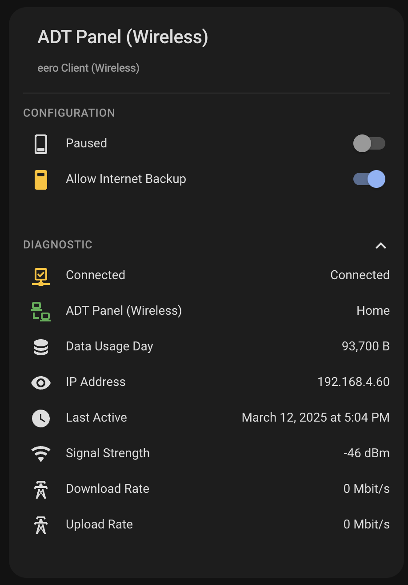
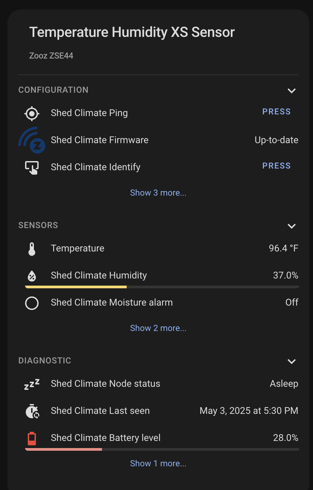
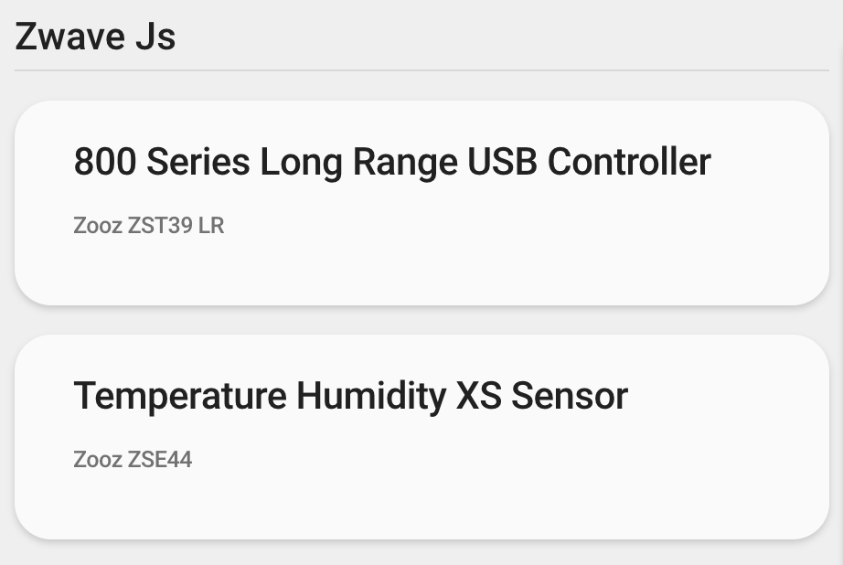

# Device Card Overview

A custom card for Home Assistant that provides a comprehensive overview of any device in your system. The card organizes device information into expandable sections, displaying sensors, controls, configuration options, and diagnostic data in a clean, user-friendly interface.


## Features

### Device Information Display

- Shows device name and model information
- Organizes entities into logical categories:
  - **Controls** – for interactive elements like buttons and switches
  - **Sensors** – for data readings and status information
  - **Configuration** – for device settings
  - **Diagnostic** – for troubleshooting information

### Problem Detection

- Automatically detects entities labeled as "problem" in the device based on their `device_class`
- Visual indication when problems are detected (card border turns red)
- Problem entities show a green or red indicator to their left


### Entity Pictures

With an optional flag, you can showcase entity pictures when available. There must exist an entity with an `entity_picture` attribute.


### Expandable Sections

- Collapsible sections for better organization of information
- Preview counts for sensors to reduce visual clutter
- Ability to expand sections to see all entities



### Entity Attributes

- Click an entity to expand it and show its attributes
- This behavior can be disabled by setting `tap_action` to "none"


### Pinned Entity State

Display a specific entity's state prominently in the card header, providing instant visibility for your most important information. Perfect for temperature sensors, battery levels, or any critical value you want to monitor at a glance.


### Percent Gauges

Visual percentage indicators for entities with percentage values. Gauges automatically change color based on the value (red for low, yellow for medium, green for high).



### Collapsible Card

Cards can be configured to start in a collapsed state. Simply click the header to expand and reveal all sections.



### Compact Mode

A space-efficient layout option that reduces padding and margins, ideal for information-dense dashboards or smaller screens.


### Advanced Sorting

Customize how entities are sorted within each section. Sort by domain, entity ID, name, or state value in either ascending or descending order.

### Pattern Matching

Use wildcards and regular expressions in your entity exclusion patterns for flexible configuration.

### Entity Interactions

- Configure custom actions for tap, hold, and double tap interactions
- Actions include navigating to other views, calling services, or opening more-info dialogs
- Setting a `tap_action` disables the entity attribute expansion behavior
- Actions can be configured in both YAML and the visual editor

### Card Editor

The card is fully configurable in the UI editor. Simply select "Custom: Device Card" when adding a new card to your dashboard, then select your device from the dropdown.

!!! caution
    The editor may delete advanced settings, such as regex or wildcards. Make a copy of the card config prior to using the UI editor.


## Quick Start

Minimal configuration with device ID:

```yaml
type: custom:device-card
device_id: YOUR_DEVICE_ID
```

Or use an entity ID (card will automatically determine the device):

```yaml
type: custom:device-card
entity_id: sensor.your_entity_id
```

The card will automatically:

- Display the device name and model information
- Organize all entities related to the device into appropriate sections
- Show collapsible sections for Controls, Configuration, Sensors, and Diagnostics
- Highlight any detected problems

## Supported Languages

- **English** (en) – Default
- **French** (fr) – Français
- **Portuguese** (pt) – Português
- **Russian** (ru) – Русский

The card automatically detects your Home Assistant language setting and displays the appropriate translations.
