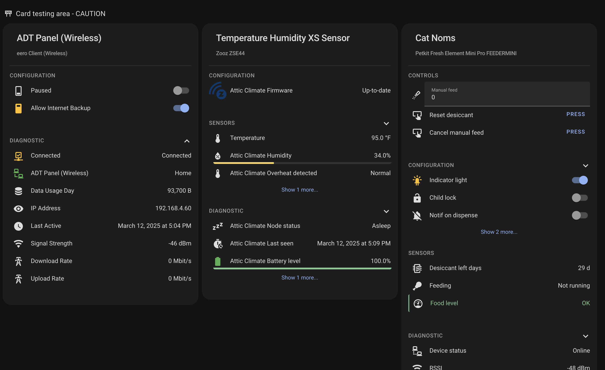

<p align="center">
    
</p>
<p align="center"><h1 align="center">Device Card</h1></p>
<p align="center">
	<em>A comprehensive card to display and organize your Home Assistant device entities</em>
</p>


[](https://github.com/hacs/integration)


## Overview

This project provides two custom cards for Home Assistant:

- **[Device Card](device-card/index.md)** – Displays a comprehensive overview of any single device, organizing entities into expandable sections (Controls, Sensors, Configuration, Diagnostics).
- **[Integration Card](integration-card/index.md)** – Automatically finds and displays all devices from a selected integration domain (e.g., zwave_js, hue).

## Installation

See the [Installation](installation.md) guide for HACS and manual installation instructions.

## Quick Start

### Device Card

```yaml
type: custom:device-card
device_id: YOUR_DEVICE_ID
```

Or use an entity ID and the card will automatically determine the device:

```yaml
type: custom:device-card
entity_id: sensor.your_entity_id
```

### Integration Card

```yaml
type: custom:integration-card
integration: zwave_js
```

## Documentation

- [Device Card](device-card/index.md) – Overview, configuration, examples
- [Integration Card](integration-card/index.md) – Overview, configuration, examples
- [Installation](installation.md) – HACS and manual setup
- [Build & Code Quality](BUILD.md) – CI/CD and SonarCloud badges
- [Troubleshooting](TROUBLESHOOTING.md) – Common issues
